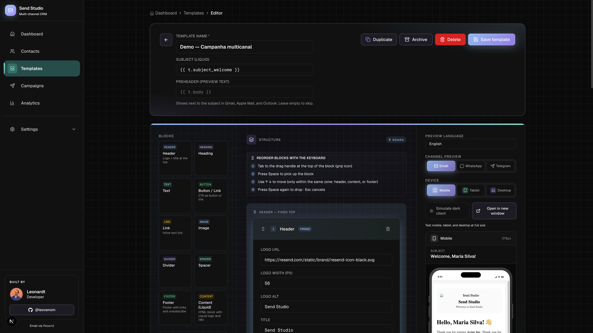
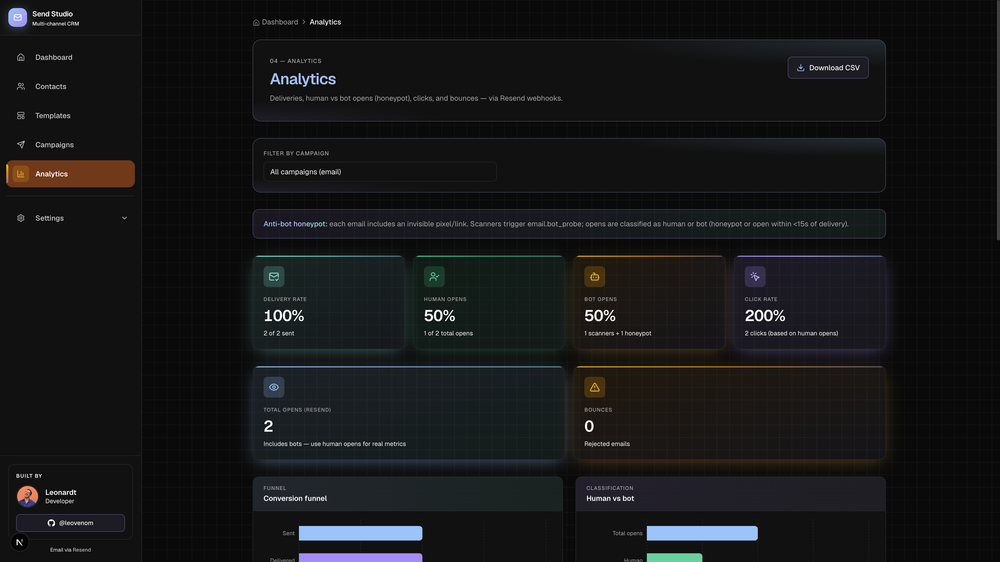
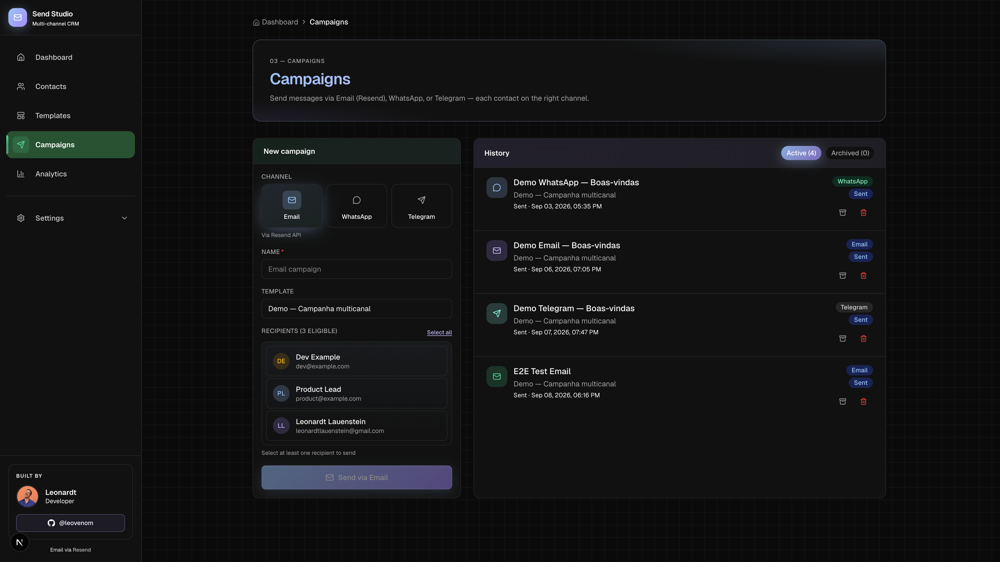

# Send Studio

**Design, send, and measure multi-channel campaigns** — a portfolio CRM built around [Resend](https://resend.com), with a block editor, Liquid templates, and webhook-driven analytics.

Built by [Leonardt (@leovenom)](https://github.com/leovenom) to demonstrate product engineering on a developer-first email platform.

**Live demo:** _add your Vercel URL_


---

## The problem

Email tools often split the workflow: design in one place, send via API, analytics somewhere else. Operators lose context; developers rebuild glue code.

**Send Studio** closes that loop in one product — from template creation to delivery metrics — the same surface area Resend customers care about.

---

## What it does

| Area | What you get |
|------|----------------|
| **Templates** | Drag-and-drop block editor, Liquid + locale per contact, AI generation |
| **CRM** | Contacts, CSV import, locale-aware fields |
| **Campaigns** | Email (Resend), WhatsApp, Telegram from one flow |
| **Analytics** | Webhook pipeline, funnel, human vs bot opens, CSV export |

### Highlights for reviewers

- **End-to-end product** — not a thin API demo; full UI from editor to metrics
- **Resend-native** — send API, signed webhooks, event-driven analytics
- **Ship-ready details** — auth on APIs, rate limits, a11y, PT/EN UI, seed + webhook simulator for demos

---

## Screenshots

### Block editor — drag-and-drop + Liquid preview



### Analytics — Resend webhooks, human vs bot opens



### Campaigns — multi-channel send (Email, WhatsApp, Telegram)



_Re-capture guide: [docs/SCREENSHOTS.md](./docs/SCREENSHOTS.md)_

---

## Under the hood

For engineers who want to see *how* it's built:

| Layer | Choice | Why |
|-------|--------|-----|
| App | Next.js 16 App Router | SSR, API routes, Vercel deploy |
| UI | React 19 + Tailwind 4 | Block editor, responsive email preview |
| Data | SQLite / Turso + Drizzle | Local dev, edge-ready production |
| Email | Resend SDK | Send + webhook events |
| Templating | LiquidJS | Per-recipient locale and merge tags |
| DnD | dnd-kit | Accessible block reordering |
| Charts | Recharts | Funnel and timeline on `/analytics` |

**Architecture in one line:**  
UI → API routes (Zod) → Drizzle → libSQL · Resend send · webhook handler → `email_events` → analytics queries.

```
Editor blocks → HTML (Liquid) → Resend API → webhook → email_events → /analytics
```

---

## Quick start (2 minutes)

```bash
git clone https://github.com/leovenom/resend-studio.git
cd resend-studio && npm install

cp .env.example .env.local
npm run db:migrate
npm run db:seed-demo
npm run dev
```

Open [http://localhost:3000](http://localhost:3000).

**Simulate analytics locally** (dev server running):

```bash
npm run simulate:webhook
```

Then visit `/analytics` — sent, delivered, opened, clicked update in real time.

---

## Environment

| Variable | When | Purpose |
|----------|------|---------|
| `RESEND_API_KEY` | Send emails | Resend API |
| `RESEND_WEBHOOK_SECRET` | Production | Verify webhook signatures |
| `DATABASE_URL` + `DATABASE_AUTH_TOKEN` | Production | Turso (serverless SQLite) |
| `STUDIO_ACCESS_TOKEN` | Production | Protect `/api/*` |
| `OPENAI_API_KEY` | Optional | AI template generation (has fallback) |

Full list: [`.env.example`](.env.example)

---

## Deploy

Local SQLite does not work on Vercel serverless. Production stack: **Vercel + Turso + Resend**.

```bash
turso db create send-studio
turso db show send-studio --url
turso db tokens create send-studio
```

Set `DATABASE_URL`, `RESEND_*`, `STUDIO_ACCESS_TOKEN`, and `NEXT_PUBLIC_SITE_URL` on Vercel.  
Webhook endpoint: `https://your-app.vercel.app/api/webhooks/resend`

---

## Scripts

| Command | Use |
|---------|-----|
| `npm run db:seed-demo` | Demo data for portfolio walkthrough |
| `npm run simulate:webhook` | Populate analytics without Resend |
| `npm run validate:i18n` | PT / EN key parity |
| `npm run lint` | ESLint (clean) |

---

## What this project shows about me

- **Product sense** — scoped a shippable CRM, not a code kata  
- **Frontend quality** — accessible editor, preview iframe, consistent design system  
- **Backend ownership** — webhooks, auth, validation, multi-channel adapters  
- **Developer empathy** — seed scripts, `.env.example`, one-command webhook sim for reviewers  

---

## Contact

- GitHub: [@leovenom](https://github.com/leovenom)  
- Project: _add repo URL if different_

---

## License

MIT
